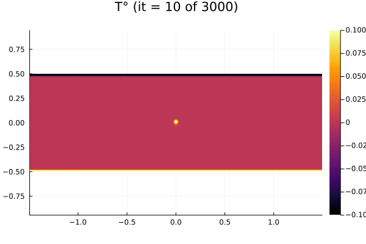
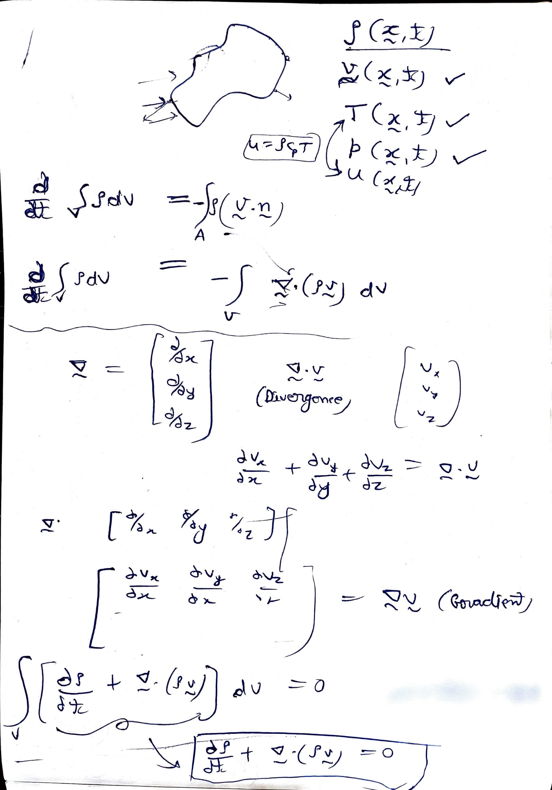
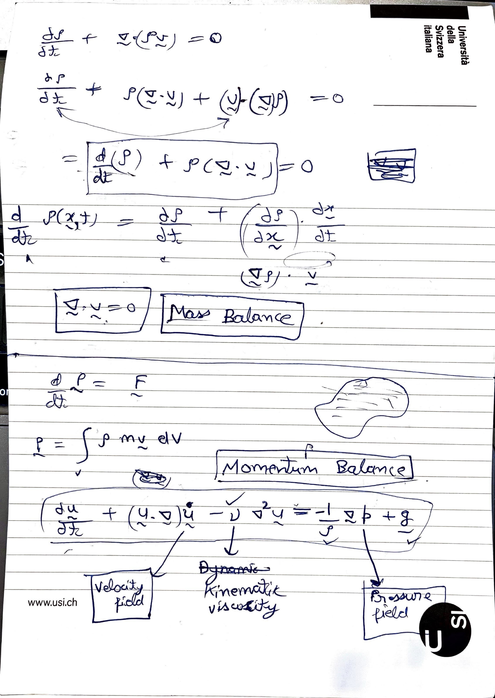
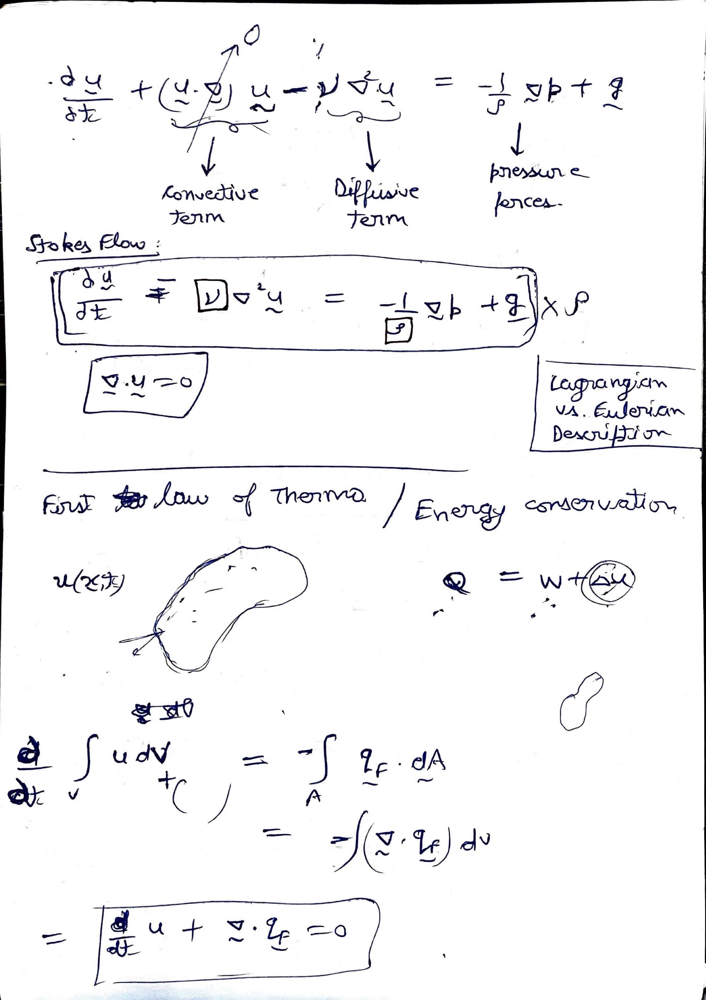
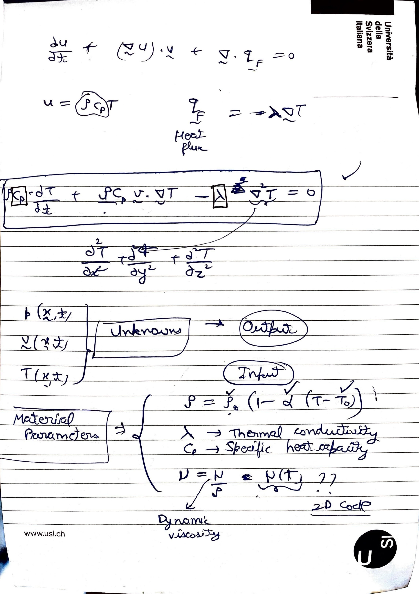

# ThermalConvection3D.jl

3D multi-GPU thermo-mechanical convection solver (lava-lamp) with an accelerated pseudo-transient solver.

## Description

The thermal convection in 3D combines a viscous Stokes flow to advection-diffusion of heat including a temperature-dependent shear viscosity. This project resolves thermal convection cells of Earth's mantle convection and plumes.

## 2D Simulation


## 3D Simulation


## Equations
<center></center>
<center></center>
<center></center>
<center></center>

## Run

To run on daint:
```bash
sbatch scripts/submit.sh
```
To create 3D visualization on local after run has completed:
```bash
scp "daint:/users/class210/scratch/viz3D_out/*" visualization
cp 3D_plot.jl visualization/
julia visualization/3D_plot.jl
convert *.png anim_3D.gif
```

## Structure

```bash
ThermalConvection3D.jl
├── docs             # documentation
├── LICENSE
├── Manifest.toml
├── Project.toml
├── README.md
├── scripts          # contains the most current version of the scripts in development
├── src              # the developed code
└── test             # testing scripts
```


## Testing

- unit and reference testing are included within the `test` folder

